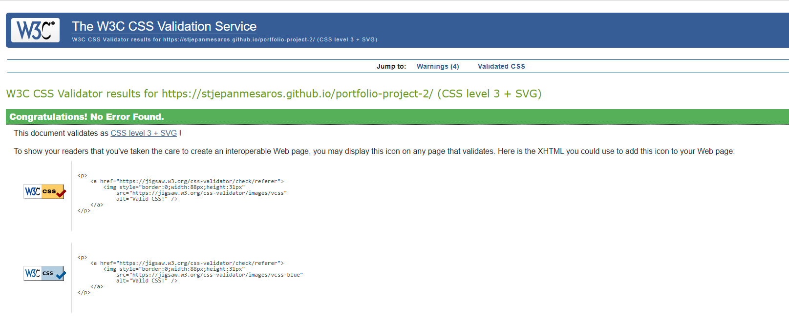

<h1 align="center">Roll Those Dice</h1>

[View the live website here.](https://stjepanmesaros.github.io/portfolio-project-2/)

## Project Rationale
This is a mini game designed to test your intuition, patience and, above all else, your luck! The goal of the game is very simple; can you predict if the next role will be higher or lower than the previous one. The fun doesn't stop there! As this is, clearly, an RNG type of a game it can get very frsutrating and daring. With time you get better at predicting the throws but just when you think you've understood it, baaaam, you didn't. The end goal is to have fun while trying to outsmart a computer.

<h2 align="center"></h2>

## CONTENTS

* [User Experience](#user-experience-ux)
  * [User Stories](#user-stories)

* [Design](#design)
  * [Colour Scheme](#colour-scheme)
  * [Typography](#typography)
  * [Imagery](#imagery)
  * [Wireframes](#wireframes)

* [Features](#features)
  * [General Features on Each Page](#all-pages)
  * [Home Page](#home-page)
  * [Coping Mechanisms Page](#coping-mechanisms-page)
  * [Contact Page](#contact-page)

* [Technologies Used](#technologies-used)
  * [Languages Used](#languages-used)
  * [Frameworks, Libraries & Programs Used](#frameworks-libraries--programs-used)

* [Testing](#testing)
    * [Code Validation](#code-validation)
    * [Accessibility Test](#accessibility-test)
    * [Performance Test](#performance-test)
    * [Feature Testing](#feature-testing)
    * [Browser Support Testing](#browser-support-testing)

* [Bugs](#bugs)

* [Deployment](#deployment)
  * [GitHub Pages](#github-pages)

* [SEO](#seo)

* [Credits](#credits)
  * [Code](#code)
  * [Content](#content)
  * [Media](#media)
  * [Acknowledgements](#acknowledgements)

## User Experience (UX) <h5>[Back To top](#contents)</h5>

-   ### User stories

    -   #### First Time Visitor Goals

        -   As a First Time Visitor, I want to easily understand the main purpose of the site and understand what is expected of me.
        -   As a First Time Visitor, I want to be able to easily navigate throughout the site and understand how it works.

    -   #### Returning Visitor Goals

        -   As a Returning Visitor, I want to try and beat my previous highscore.
        -   As a Returning Visitor, I want to find new and updated content.

## Design <h5>[Back To top](#contents)</h5>

-   ### Colour Scheme
    -   The color pallete used was intended to give a classy and modern style to the website while maintaing minimalistic approach.
        <h3 align="center"></h3>

-   ### Typography
    -   The font used is Bodoni Moda for text; sans-serif as a fallback font.

-   ### Imagery
    -   Images were generated by myself using MidJourney.

-   ### Wireframes
    I created wireframes using the wireframe [Balsamiq](https://balsamiq.com/wireframes/desktop/#) website.

    The website has 3 stages, namely home page stage, rolling the dice page and a page if you lose the roll. The website is also prepared to reset the website, which show as a "Reset the game?" button to the user after failing to predict the next roll correctly.

    Here are the wireframes for each stage:
    -   Home Page Stage
        <h3 align="center"></h3>
    
    -   Rolling Stage
        <h3 align="center"></h3>
    
    -   Lost The Game Stage
        <h3 align="center"></h3>
    
## Features <h5>[Back To top](#contents)</h5>

-   ### Home page
    -   Home page has a title, two buttons to choose a number of dice, a bartender image that displays text and a footer with my GitHub link.

-   ### Rolling stage
    -   At this stage we have the number of dice chosen and rolled. Two buttons that user can press do predict if the next roll will be higher or lower.

-   ### Game Lost Stage
    -   This stage shows the user their final score and displays a reset button that they can refresh the website with.

-   ### Footer
    -   The footer shows a link to my personal GitHub profile.

## Technologies Used <h5>[Back To top](#contents)</h5>

### Languages Used

-   [HTML5](https://en.wikipedia.org/wiki/HTML5)
-   [CSS3](https://en.wikipedia.org/wiki/Cascading_Style_Sheets)
-   [JavaScript](https://developer.mozilla.org/en-US/docs/Web/JavaScript)

### Frameworks, Libraries & Programs Used

-   [Google Fonts:](https://fonts.google.com/)
    - Google fonts were used to import the 'Agdasima and Bacasime Antique' font into the style.css file which is used on all pages throughout the project.
-   [Git](https://git-scm.com/)
    - Git was used for version control by utilizing the Gitpod terminal to commit to Git and Push to GitHub.
-   [GitHub:](https://github.com/)
    - GitHub is used to store the projects code after being pushed from Git.
-   [Balsamiq](https://balsamiq.com/wireframes/desktop/#)
    - Balsamiq was used to create the [wireframes](#wireframes) during the design process.
-   [Font Awesome](https://fontawesome.com/docs)
    -   Font awesome was used to add the website title icon and a GitHub icon in the footer.

## Testing  <h5>[Back To top](#contents)</h5>

### Code Validation

The W3C Markup Validator, W3C CSS Validator and JSHint services were used to validate every stage of the website.

-   [W3C Markup Validator](https://jigsaw.w3.org/css-validator/#validate_by_input)
    <h3 align="center"></h3>

-   [W3C CSS Validator](https://jigsaw.w3.org/css-validator/#validate_by_input)
    <h3 align="center"></h3>

-   [JSHint Validator](https://jshint.com/)
    <h3 align="center"></h3>

### Accessibility Test
To test the accessibility of the website [WAVE](https://wave.webaim.org) was used.

- Wave Results

    <h3 align="center"></h3>

### Performance Test
To test the performance of the website, Lighthouse testing for mobile and desktop was performed.

- Desktop Results

    <h3 align="center"></h3>

- Mobile Results

    <h3 align="center"></h3>

### Feature Testing

| Feature | Expected Outcome | Testing Performed | Result | Pass/Fail |
| --- | --- | --- | --- | --- |
| `Home Page` |
|   |   |   |   |
| Buttons | When clicked will choose a number of dice to be played with. | Clicked on the buttons. | One die appeared or two dice appeared. | Pass |
| `Rolling Stage` |
|   |   |   |   |
| Buttons | When clicked one should determin if the next roll will be higher and the other button says it will be lower. Both have a functionality to roll the die/dice and compare rolls; ultimately make the score go up or let the user know that they lost the game. | Clicked on both buttons to see if the logic behind it is correct. | Rolls were accurately compared and the scoring system works. | Pass |
| `Footer` |
|  |  |  |  |  |
| GitHub link | When clicked the user will be redirected to the my GitHub profile. | Clicked icon | Redirected to the GitHub profile page in a new window. | Pass |

### Browser Support Testing

| Device/Browser | Expected Performance | Testing Performed | Result |
| --- | --- | --- | --- |
| Google Chrome | Full functionality of external and internal links as well as full functionality of the buttons. | Tested all features, links and buttons. | Passed with full functionality. |
|  |  |  |  |
| Brave | Full functionality of external and internal links as well as full functionality of the buttons. | Tested all features, links and buttons. | Passed with full functionality. |
|  |  |  |  |
| Safari | Full functionality of external and internal links as well as full functionality of the buttons. | Tested all features, links and buttons. ||
|  |  |  |  |
| Internet Explorer | FFull functionality of external and internal links as well as full functionality of the buttons. | Tested all features, links and buttons. | Passed with full functionality. |
|  |  |  |  |
| Microsoft Edge | Full functionality of external and internal links as well as full functionality of the buttons. | Tested all features, links and buttons. | Passed with full functionality. |
|  |  |  |  |
| iPhone 13 Pro Max | Full functionality of external and internal links as well as full functionality of the buttons. | Tested all features, links and buttons. | Passed with full functionality. |
|  |  |  |  |
| Samsung s21 | Full functionality of external and internal links as well as full functionality of the buttons. | Tested all features, links and buttons. | Passed with full functionality. |

